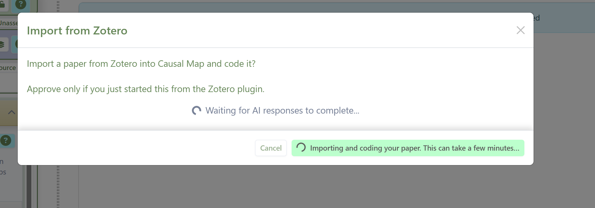
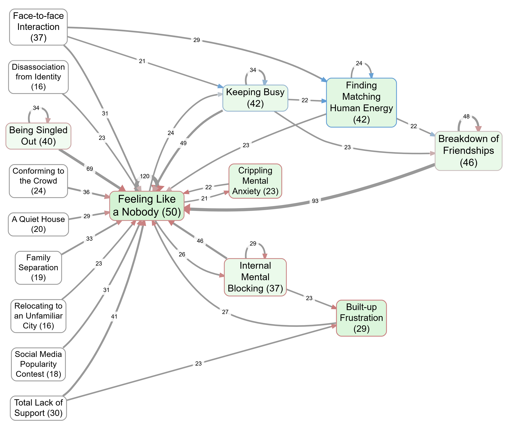

# Causal Map for Zotero

Turn a paper in your Zotero library into a causal map, a diagram of what causes what, in a couple of clicks.


## What it does

Pick an item in Zotero and choose **Make a Causal Map**. Causal Map reads the paper and draws a map: the boxes are factors taken from the text, the arrows are causal claims, and every arrow is backed by a quote from the paper. You then explore, filter, edit and share it in the Causal Map web app.

**It is free to try.** It uses your own Causal Map account; new users sign up with one click and get monthly AI credits, enough to map roughly **15 papers of about 20 pages each, every month, at no cost** (on the default Gemini Flash model).



## Install

1. Download the plugin: [causalmap-zotero.xpi](https://github.com/stevepowell99/causalmap-zotero/releases/latest/download/causalmap-zotero.xpi)
2. In Zotero, go to **Tools, Plugins**, click the gear icon, choose **Install Plugin From File**, and pick the file you downloaded.
3. Restart Zotero.

That is all. Zotero plugins need no signing, so it installs straight away, and it updates itself when a new version is released.

## How to use

1. Right-click an item in your library (one with a PDF that Zotero has read) and choose **Make a Causal Map**.
2. A Causal Map tab opens in your browser. Sign in or sign up, then click **Approve**.
3. Causal Map imports the paper and codes it. When it finishes, your map appears.



The new project is private to your account. Rename, edit, share or export it like any other Causal Map project.

## Good to know

- One item at a time for now. Mapping a whole collection is on the way.
- The paper needs a readable attachment (a PDF Zotero has indexed). Items with no text are skipped.
- It is free to try. A free account gets 10 AI credits a month, and coding runs about 30 pages per credit, so a free user can map roughly 15 papers of about 20 pages each per month at no cost on Gemini Flash. Heavier use needs a paid plan.
- Only send material you have the right to process. The text goes to Causal Map under your account, the same as if you had uploaded the PDF yourself.

---

## How it works

The plugin reads the item's text and hands it to the hosted Causal Map app, which creates the project and runs the normal coding. It never holds your login: you approve a short-lived pairing in the browser, and Causal Map does the rest.

- It talks to the hosted service at app.causalmap.app (and the Causal Map database). There is nothing to install or run locally.
- It is a standard Zotero 7/8/9 bootstrapped plugin.
- The server side (the pairing function and import flow) lives in the main Causal Map app repository, under `docs/zotero`.

## Releasing (maintainers)

Bump `version` in `manifest.json`, then `git tag vX.Y.Z && git push --tags`. A GitHub Action builds the `.xpi`, generates `update.json`, and publishes a release; installed users update automatically. See `.github/workflows/release.yml`.

## Modify the plugin (developers)

To change the plugin, clone the repo and build the `.xpi`:

```
npm install
npm run pack    # writes build/causalmap-zotero.xpi
```

Install that file as above. There is no local backend: the plugin still uses the hosted Causal Map. To point it at a local webapp while developing, set the Zotero pref `extensions.causalmap.appUrl` to your local URL (Settings, Advanced, Config Editor).
